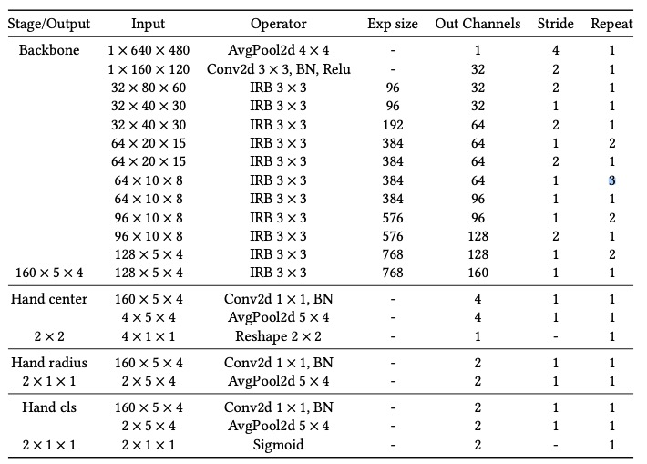
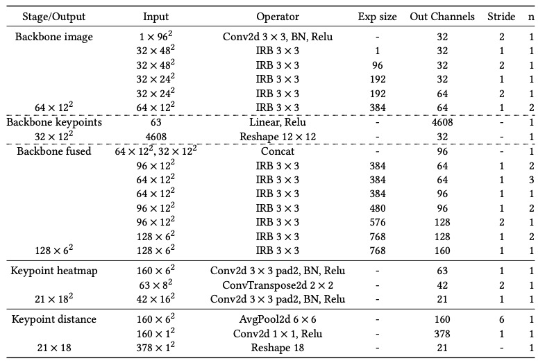

 # MEgATrack.pytorch
An unofficial implementation of MEgATrack's DetNet and KeyNet, proposed in **MEgATrack: Monochrome Egocentric Articulated Hand-Tracking for Virtual Reality** by FaceBook.

The Iverted Residual Block reuses parts of the great code from [MobileNetv2.pytorch](https://github.com/d-li14/mobilenetv2.pytorch)

# DetNet Architecture

# KeyNet Architecture
